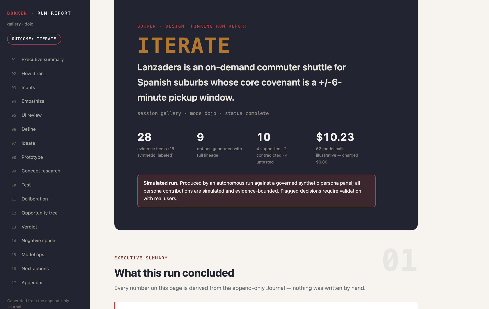

# Bokken

[](https://github.com/maglionejm/bokken/actions/workflows/ci.yml) [](https://pypi.org/project/bokken/) [](LICENSE)

> An agentic harness for Design Thinking — one executable, instrumented loop.
> **Test with wood; commit steel when it counts.**

Bokken encodes the **Empathize → Define → Ideate → Prototype → Test** loop as an
executable, event-sourced, governed process. Point it at something tangible — an
app repository, business and performance metrics, interview transcripts — and it
runs the loop either with you in it (**Founder mode**, interactive at the
terminal) or fully autonomously against a governed synthetic persona panel
(**the Dojo**). Every step lands in **the Journal**, an append-only, hash-chained
process ledger, and a finished run produces two deliverables:

1. **The Session Dossier** — outcomes, the process narrative with receipts, and
   the full machine-readable evidence graph.
2. **The handoff** — build-ready **OpenSpec specifications** for the validated
   concept's MVP, ready for a coding agent to ingest and implement.

Terminal-first and MCP-consumable. Python. No GUI.


*A finished run: verdict-first report, simulated-run banner, receipts on every number ([live example](https://maglionejm.github.io/bokken/gallery/demo-report.html)).*

## Why

Meeting AI documents the past; canvas tools hold sticky notes; app generators
build artifacts without the understanding. Bokken is a harness, not a bot: it
owns the process state, the method library, the evidence, and the audit trail —
so every output can answer *how do you know, who said so, what did we reject,
and why*. In an era of "AI did it", the defensible asset is a replayable account
of the reasoning. That account is the Journal, and it is built in, not bolted on.

## How it works

```
brief + inputs ──► intake ► empathize ► define ► ideate ► prototype ► test ► complete
(repo, metrics,      │         ▲          ▲                             │        │
 interviews)         │         └──────────┴───────── loop-backs ────────┘        │
                     ▼                                                           ▼
              the Journal (append-only, hash-chained JSONL; state = replay)      │
                     │                                                           │
                     ├──► Session Dossier (outcomes · narrative · evidence graph)
                     ├──► OpenSpec handoff (MVP specs for a coding agent)
                     ├──► Reports (PPTX deck + portable HTML with OST view)
                     └──► bokken validate ► real-human interviews (terminal/Twilio)
                                            rescore the register with reported evidence
```

- **Stages are a real state machine** with entry/exit criteria and first-class
  loop-backs; every transition is journaled with the evidence that justified it.
- **Facilitation is auditable**: every intervention is a named, budgeted move
  from the **Kata** (reframes, assumption flags, timebox pivots, devil's
  advocate, loop-back proposals…), logged like a tool call — executed or
  suppressed, with reasons.
- **The Dojo is governed simulation**: personas are cast with documented
  sampling and role agents (skeptic, feasibility, viability), answer only from
  the ingested corpus **with citations or abstain** (abstentions become research
  debt), never see the sponsor's preferred answer, and never evaluate work they
  helped create (contamination firewall). Runs stop on budgets, novelty floors,
  or criteria — never on "the answer looked good".
- **Honesty is enforced in code**: synthetic contributions are labeled at the
  record level; decisions resting on simulated or assumed evidence carry
  `requires real validation`; the Dossier states what the run *did not* do; and
  the handoff turns contradicted assumptions into exclusions and validation debt
  into mandatory tasks. None of this is configurable away.
- **The product is tested, not assumed**: with `--app-url` the run walks the
  real UI (SPA-aware), functionally exercises every inventoried feature with
  works/broken/unclear verdicts, and `wireframe_html` prototypes are generated
  on the repo's own CSS tokens and exercised in a browser before the test
  panel judges them.
- **The market is on the record**: after the concept is chosen, an explicitly
  authorized web research pass (`--allow-web-research`) produces competitors
  with overlap, sourced signals, regulatory notes, and risks — journaled as
  `reported` evidence that feeds the assumption register.
- **Real humans close the loop**: `bokken validate` turns the research debt
  into an interview guide and an agentic interviewer moderates real
  participants (terminal, or Twilio SMS/WhatsApp behind the `[interview]`
  extra) — consent is asked first, once, and journaled before any question
  goes out; every exchange is `reported` human evidence, and the register is
  rescored against it.
- **The run travels**: `bokken pack` produces one portable archive with an
  honest manifest (verdict, cost, sha256 index); `--deliverables-only` for
  external sharing states exactly what was omitted.
- **The output executes**: `bokken handoff --emit claude-code|cursor|codex`
  renders the OpenSpec package as an execution prompt your coding agent
  follows directly — evidence pointers included.
- **The deliverables are yours**: `bokken export --theme acme.json`
  white-labels the report (brand color, label, footer) without touching a
  single journal-derived claim.
- **Learnings compound**: every finalized run feeds the insights library; the
  next run on the same product starts knowing what was supported,
  contradicted, or broken — with session provenance on every borrowed line.
- **Fusion cost architecture**: frontier lanes judge (Fable 5 / Opus 5), a
  cached Sonnet 5 sidekick lane reads; `bokken costs` reports spend, cache
  hit-rate, and grounding health (abstentions forced by unresolved citations)
  from the journal.
- **Crash-safe by construction**: sessions are durable, named, and resumable;
  kill the process anywhere and `bokken run` continues from the ledger.

## Quickstart

See a complete run first — no API key, no network, no cost
([sample output](https://maglionejm.github.io/bokken/gallery/demo-report.html)):

```sh
uvx bokken demo
# halt: completed - dossier generated; handoff specs generated; report exported
# you were charged $0.00 - 0 network calls, 0 real tokens; the journaled
# usage is an illustrative live-run profile: ~$10 list price across 62 calls
```

With the `[ui]` extra installed, the demo also walks a bundled mock of the
product in a real browser: per-feature functional tests, screenshots, and an
honest `broken` finding land in the journal and both reports.

Then point it at something real. Requires [uv](https://docs.astral.sh/uv/)
and a provider API key — Anthropic is the default, OpenAI via the extra:

```sh
uvx bokken doctor        # one-screen environment check, every gap with its fix
uvx bokken init --from-repo . --yes   # or draft the brief FROM your repo
                         # (templates still available: saas-retention,
                         #  consumer-app, internal-tool)

# default provider
export ANTHROPIC_API_KEY=...

# OpenAI provider
uvx --from 'bokken[openai]' bokken version
export OPENAI_API_KEY=...
uv run bokken new retention --provider openai --model gpt-5 \
  --reasoning-effort high --brief bokken-brief.json --mode dojo
```

Every `bokken run` states the typical cost and the session's token guardrail
before spending, and prints a receipt (`$ · model calls`) whenever it halts;
`bokken costs <name>` breaks it down per stage × prompt × class.

**Claude Desktop**: install natively with the one-click bundle —
[`bokken-<version>.mcpb`](https://github.com/maglionejm/bokken/releases/latest)
(double-click; prompts for key/workspace/roots; the demo needs no key).

Optional extras: `uvx --from 'bokken[ui]' bokken ...` unlocks the UI
walkthrough and per-feature tests (plus `uvx playwright install chromium`
once); `bokken[interview]` unlocks the Twilio interview channel.

**Development mode** (the repo is the runtime — what the maintainers use):

```sh
git clone https://github.com/maglionejm/bokken && cd bokken
make install
export ANTHROPIC_API_KEY=...
```

Run the loop autonomously against your product, your numbers, and your research:

```sh
uv run bokken new retention \
  --mode dojo \
  --brief brief.json \
  --repo ./myapp \
  --metrics data/kpis.csv \
  --discussion research/interview-ana.md

uv run bokken run retention          # halts at each stage gate
uv run bokken gate retention approve
uv run bokken run retention          # ... approve gates until:
# halt: completed
# finalization: dossier generated; handoff specs generated

uv run bokken journal retention --type decision   # every decision, with dissent
open .bokken/sessions/retention/dossier/dossier.md
ls   .bokken/sessions/retention/handoff/openspec/changes/
```

Or be the counterpart yourself: `--mode founder` and Bokken interviews *you*,
you pick the winning option, and you score the assumption register.

## The deliverables

**Session Dossier** (`dossier/`): Part A — outcomes with ledger receipts on
every claim; Part B — the process narrative (pivotal moments, why the losers
lost, dissent and how it was handled, loop-backs with triggers); Part C —
`dossier.json`, the full evidence graph (insights↔evidence, idea lineage, IBIS
decision records, persona provenance cards, model traces).

**Reports** (`report/`): a strategic PPTX deck (decision tables, HILL banner,
verdict-colored register) and a portable single-file HTML (chaptered, agent
deliberation, per-feature UI test cards, Opportunity Solution Tree, next
actions) — deterministic renderings of the Journal.

**OpenSpec handoff** (`handoff/`): a strict OpenSpec change package
(`proposal.md`, `design.md`, capability specs with SHALL requirements and
WHEN/THEN scenarios, `tasks.md`) plus `traceability.json` mapping every
requirement to the ledger events it rests on. Copy it into any repo's
`openspec/changes/`, run `openspec validate --strict`, and hand it to your
coding harness. See [docs/handoff.md](docs/handoff.md).

## Surfaces

| | |
| --- | --- |
| **CLI** | `demo · init · new · run · step · stop · status · list · gate · back · journal · dossier · handoff · export · pack · costs · validate · library · doctor · serve` — every read verb speaks `--json`; exit codes are stable (0 success, 1 unexpected, 2 refused) |
| **MCP** | `bokken serve` (stdio): 14 tools + 4 resources over the same core with identical result shapes; agent actions are journaled with the client's handshake identity — see [docs/mcp.md](docs/mcp.md) |

## Documentation

| Doc | What it covers |
| --- | --- |
| [docs/architecture.md](docs/architecture.md) | The layer stack, runtime loop, design invariants, blueprint mapping |
| [docs/operating.md](docs/operating.md) | Setup, creating and driving runs, gates, budgets, auditing, deliverables, troubleshooting |
| [docs/events.md](docs/events.md) | The Journal: envelope, hash chain, and the full event taxonomy v1 |
| [docs/handoff.md](docs/handoff.md) | The OpenSpec handoff contract and ingestion workflow |
| [docs/mcp.md](docs/mcp.md) | MCP tools, resources, and client setup |
| [docs/agents.md](docs/agents.md) | The agent registry: every actor, its lane, its model, and what it may never do |

## Project structure

```
bokken/
├── src/bokken/
│   ├── journal/       # the ledger: schema, store, replay, queries (the moat)
│   ├── orchestrator/  # the DT state machine, runner, gates, budgets
│   ├── stages/        # the five stage engines (both modes)
│   ├── kata/          # the facilitation move library
│   ├── panel/         # persona casting, typed corpus, grounding, firewall
│   ├── models/        # model routing, journaled invocations, prompts
│   ├── dossier/       # Session Dossier generation
│   ├── handoff/       # OpenSpec MVP-spec generation
│   ├── cli/           # the terminal surface
│   ├── mcp/           # the MCP surface
│   └── contract.py    # one result contract for both surfaces
├── openspec/          # bokken's own spec-driven development (13 capabilities)
├── docs/              # documentation + the GitHub Pages site
├── tests/             # 127 tests; the whole loop runs offline against a fake provider
└── scripts/           # live smoke run
```

## Development

```sh
make check    # ruff + pytest + openspec validate --strict  — the definition of done
```

Bokken is built spec-first with [OpenSpec](https://github.com/Fission-AI/OpenSpec)
— the same format it hands off. Every behavior change starts as a change under
`openspec/changes/` and is archived into `openspec/specs/` when implemented.
See [CONTRIBUTING.md](CONTRIBUTING.md) and [CLAUDE.md](CLAUDE.md) (the project
constitution).

Once a concept is selected, an authorized deep web research pass
(`--allow-web-research`) produces a structured market record — competitors
with overlap, sourced signals, regulatory notes, risks — that feeds the
assumption register and the reports.

The full actor roster — lanes, models, and what each agent may never do —
lives in [docs/agents.md](docs/agents.md).

Models: `claude-fable-5` (effort high, Opus fallback) for research and challenge
agents, `claude-opus-5` (adaptive, effort high) for execution and documentation,
`claude-haiku-4-5` for lightweight signal extraction — every call journaled with
prompt version, token
usage, and request id. The entire test suite runs offline.

## Naming

A *bokken* is the wooden practice sword: you rehearse with wood until failure is
boring, and commit steel only when the risk is understood. Inside the harness:
the **Journal** (the faithful record of how understanding was earned), the
**Kata** (named, drilled, repeatable moves), the **Dojo** (where practice runs
full-contact with no client in the room), and **sparring sessions** (runs
against synthetic participants).

## Stability and support

As of v1.0, these surfaces are **stable**: the Journal event taxonomy (v1,
with `schema_version` on every event and `bokken_version` in each session's
config snapshot), the CLI verbs and their `--json` shapes, the MCP tools and
resources, and the deliverable formats (Dossier, handoff package, reports).
**Experimental** and subject to change: tuning knobs (`ideation.*`,
`empathize.*`, `ui_tests.*`, `walkthrough.*`), the Twilio interview channel,
and the insights-library record shape.

Active development is currently **paused while we gather real-user
feedback**: issues are triaged, pull requests are welcome, and the spec-first
workflow (`openspec/`) is the front door for contributions — see
[CONTRIBUTING.md](CONTRIBUTING.md).

## License

[Apache-2.0](LICENSE). Copyright 2026 Juan Martín Maglione and Marc Puig.

Created and maintained by [Juan Martín Maglione](https://github.com/maglionejm) and [Marc Puig](https://github.com/mpuig).
